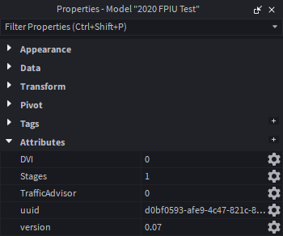

??? warning "Documentation is a Work in Progress"
    This documentation is a work in progress and may be missing information or contain errors.
    If you need help please contact us on our [Discord server](https://redon.tech/discord)!

    If you know about this topic and want to help us, please consider contributing to this page on [GitHub](https://github.com/Redon-Tech/Emergency-Vehicle-Creator).

In order to make working with and controlling patterns easier, EVH makes use of the [Roblox attributes system](https://create.roblox.com/docs/scripting/attributes#set-attributes), allowing for easy access to pattern data on vehicles.

You can see this in studio by entering play mode, selecting an emergency vehicle and observing the attributes tab in the properties window. See the image below for an example:


It is safe to ignore the uuid and version attributes, as these are used internally by EVH.

## How does this tell EVH what pattern to use?
EVH uses the name of the attribute as a representation of the function, the value of the attribute is then used to determine what pattern to use.

For example, the `Stages` attribute is used to determine what light pattern to use. If the value of the attribute is set to `1`, EVH will use the pattern assigned to stage 1 for that vehicle.

## How to use these attributes to determine current patterns
This is also extremely useful for determing what pattern is currently active on a vehicle.
Here's a code snippet showing how to get the current stage pattern of a vehicle:

```lua
-- Client or server-side script
local car = ... -- reference to the vehicle model
local currentStage = car:GetAttribute("Stages")
print("Current stage pattern is: ", currentStage)
```

To do something whenever the attribute changes, you can use the `GetAttributeChangedSignal` function like so:

```lua
-- Assuming same context as above
car:GetAttributeChangedSignal("Stages"):Connect(function()
    local newStage = car:GetAttribute("Stages")
    print("Stage pattern changed to: ", newStage)
end)
```

## How to set patterns using these attributes
Setting patterns is just as easy! You can simply set the attribute to the desired pattern value.

Here's a code snippet showing how to set the stage pattern of a vehicle to pattern 2:

```lua
-- Server-side script
local car = ... -- reference to the vehicle model
car:SetAttribute("Stages", 2)
```

!!! note "Server-Side Only"
    The above code snippet must be run on the server-side in order for all clients to see the change.

    If the client is the driver of the vehicle, it is possible to update the attribute from the client-side using the following code snippet:
    
    ```lua
    -- Client-side script
    local car = ... -- reference to the vehicle model
    local EVHEvent = car:WaitForChild("EVHEvent")

    EVHEvent:FireServer("UpdateFunction", "Stages", 2)
    ```

## :material-check-circle: All Done!

