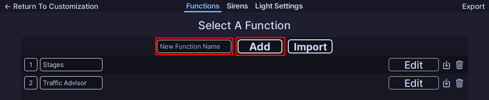
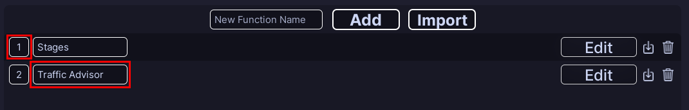
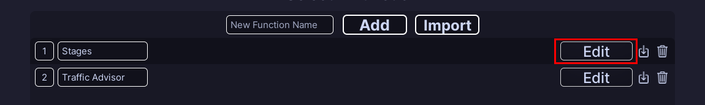

!!! tip ""
    Prefer videos? Check out our [YouTube playlist](https://youtube.com/playlist?list=PL7OqW0xeBKZTbk4QMl-6v3V_x11pZBV0W&si=e_bKE-MbL-B76wQk) for video guides on how to use the plugin.

??? warning "Documentation is a Work in Progress"
    This documentation is a work in progress and may be missing information or contain errors.
    If you need help please contact us on our [Discord server](https://redon.tech/discord)!

    If you know about this topic and want to help us, please consider contributing to this page on [GitHub](https://github.com/Redon-Tech/Emergency-Vehicle-Creator).

Awesome, now that you have set up your vehicle for ELS, it's time to set up the functions that will make your vehicle come to life! 

## What are Functions?

Functions are the basic building blocks of ELS in EVC. Each function is a collection of patterns and activations to switch between those patterns. Patterns are what you might typically think of as a "stage" in ELS, basically the actual data used for flashing lights. 

???+ example "Simple ELS Function"
    A simple ELS setup might have a `Stages` function with three patterns: `Stage 1`, `Stage 2`, and `Stage 3`. The activations for this function would consist of a cycle activation on the keybind J to cycle through the three stages.

## Creating a Function

By default your vehicle will come with two functions: `Stages` and `Traffic Advisor`. You can create as many functions as you want to suit your vehicle's needs.

Creating a function is easy! Simply enter the name in the "New Function Name" field and click "Add". This will create a new function with one pattern (with no data) and a default activation.

## Configuring a Function

Once you have created a function (or want to edit an existing one), you can simply change the name of the function by clicking on the name and changing it.

You may have also noticed the number next to the function name. This is the "weight" of the function, this determines which function has priority when two patterns are trying to use the same light. A function with a higher weight will take priority over a function with a lower weight. You can change the weight of the function by clicking on the number and changing it.

## Deleting a Function

To delete a function, simply click the trash can icon next to the edit button. This will delete the function and all of its patterns and activations. Be careful when deleting functions, as this action cannot be undone!

---

## Creating Patterns

To open the list of patterns for a function, simply click the edit button on the right. This will open the pattern list for that function, in this menu you can also switch to the activations tab to edit the activations for that function.

Once you have opened the pattern list, you can create a new pattern by clicking "Add Pattern". This will create a new pattern with no data. Patterns do not have names and are simply identified by a number. Only one pattern can be active at a time per function.

Clicking edit on a pattern will open the [pattern editor](.//..//..//patterns/flashers.md), where you can customize the pattern to your liking.

## :material-check-circle: All Done!

Now that you have successfully inserted your first vehicle, you can start customizing it to your liking!

Here are some recommended next steps to help you get started:

1. **[Creating a Pattern](.//..//..//patterns/flashers.md)**: Learn how to create your first pattern.
2. [Customize Activations](./activations.md): Learn how to customize a functions activations.
3. [Siren Setup](..//siren-setup.md): Learn how to setup and configure sirens.

---

If you encounter any issues or have questions, feel free to [contact us on Discord](https://redon.tech/discord).