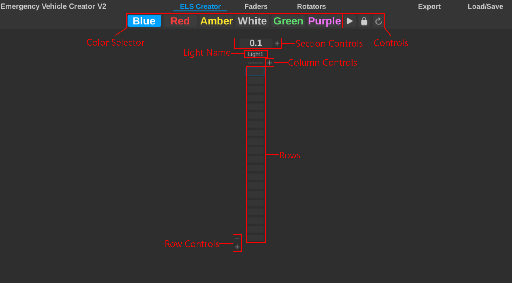

---
  authors:
    - parker02311
---

## Overview

When you first open Emergency Vehicle Creator you will be greated by the first screen.
This screen is the ELS creator. It may look a bit confusing at first but it is actually quite simple.
Here is a breakdown of the ELS creator:

There is a lot going on there, so lets get a brief overview of each label.

=== "Color Selector"
	This is where you can select the color of the lights. 
	You can customize the colors after exporting the pattern.

	You can also use `1-6`, `Q-Y`, `NumPad 1-6` to quickly select a color.

	`1-6` may not work because of a new Roblox beta feature.

=== "Controls"
	These are controls for the entire screen. These controls tend to reappear throughout the plugin.

	- **Play/Pause**: This button plays or pauses the pattern playback. You can also use `p`.
	- **Lock/Unlock**: This prevents you from dragging the mouse over multiple columns.
	- **Reset**: This resets the pattern to the default state.

=== "Section Controls"
	The ELS creator is devided into sections, this allows for more organization.
	These controls allow you to add, remove, and change the wait time.
	Adding or removing depends on the current sections positiong.

	Wait time is used to determine how quickly the lights will change. The higher the number the longer it will take.
	We recommend keeping the number below 0.1, for example 0.03 is great for fast patterns.

=== "Light Name"
	The light name is well, the name of the light inside the lightbar. This textbox will also dissapear and show the
	current light color when playing back your pattern.

=== "Column Controls"
	These controls allow you to add and remove columns. 
	Columns are also commonly referred to as "lights" in ELS.

	Each column stores their own pattern and maps to a light on the vehicle.

=== "Rows"
	These little boxes are where you actually create the pattern.

	When you click on a box it will change the color of the light to the color selected in the color selector.

	When you right click on a box it will remove the color from the light.

	If you continue to hold down either mouse button you can drag your mouse to quickly change multiple boxes.

=== "Row Control"
	These controls allow you to add and remove rows.
	This allows you to easily change the pattern length.

## Terminology

We used a few terms in the overview that you may not be familiar with. Here is a brief explanation of each term:

- **Section**: A section is a group of columns. This allows you to organize your lights into groups.
- **Column**: A column is a single light on the vehicle. Each column can have its own pattern.
- **Row**: A row is a single frame in the pattern.
- **Pattern**: A pattern is a sequence of rows that is played back on the vehicle.
- **Wait Time**: The time between each row. The higher the number the longer it will take.

---

## Using Sections

Sections are a great way to organize your lights. You can add a section by clicking the `+` button next to the section controls.
You can remove a section by clicking the `-` button next to the section controls.

Sections are also useful for changing the wait time. Using different wait times in different sections can create some interesting patterns.

Here is an example of using sections. In this image all these sections share a wait time of 0.05.
However, you can easily change the wait time for each section to create a more complex pattern.

Additionally, notice how only the last section contains the `+` and `-` buttons.
This is because you can only add or remove sections at the end.

### Using Columns

Additionally, in the screenshot above you can see that each section contains a number columns.
Columns are used to represent the lights on the vehicle. They hold rows which are used to create the pattern.

You can add a column by clicking the `+` button next to the column controls. You can remove a column by clicking the `-` 
button next to the column controls. And just like sections, you can only add or remove columns at the end.

---

## Creating a Pattern

Creating a pattern is quite simple. You can click on a box to change the color of the light. You can right click on a box to remove the color from the light. You can also drag your mouse to quickly change multiple boxes.

You can switch between colors by clicking on the color selector or using `1-6`, `Q-Y`, `NumPad 1-6`.

You can preview your pattern by clicking the play icon or pressing `p`. You can also pause the same way.

If you want to reset your pattern you can click the reset button.

---

## Next Steps

If you would like to export the pattern onto a vehicle, check out the [Exporting a Pattern](./exporting.md) guide.