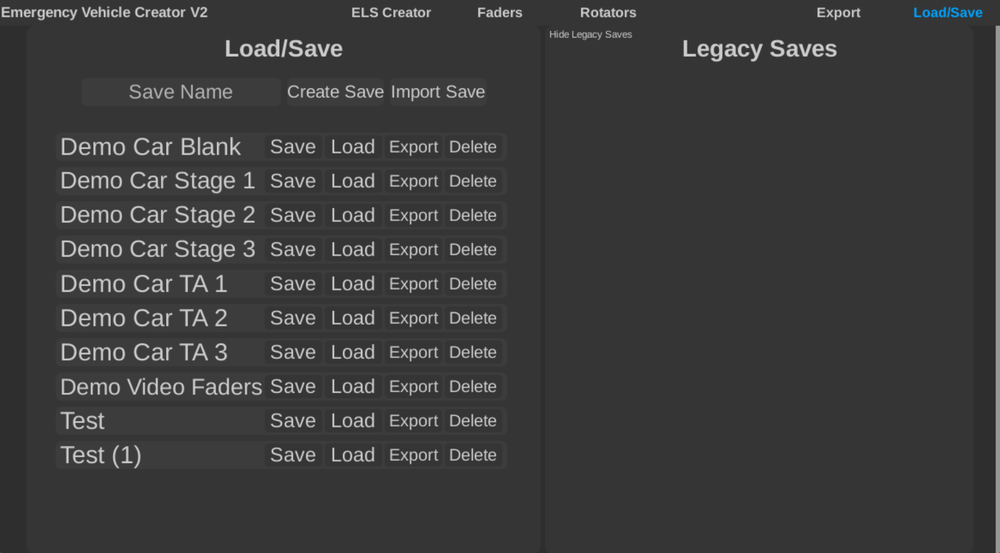

---
  authors:
    - parker02311
---

## Overview

Saving and loading is a very important feature in Emergency Vehicle Creator. It allows you to save your work and come back to it later. This is especially useful for large projects that may take a long time to complete. Here is a breakdown of the saving and loading feature:

Brief overview:

=== "Load/Save"
	This is the primary place for saves.

	Use the create save button to create a new save.

	You can also import a save from a file.

=== "Legacy Saves"
	This is where you can find your old saves. These saves are from V1.

---

That's literally it. It's a very simple feature but it is very important.