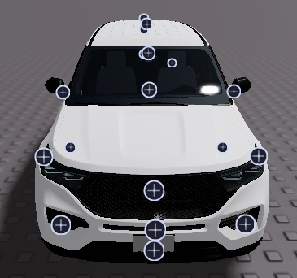
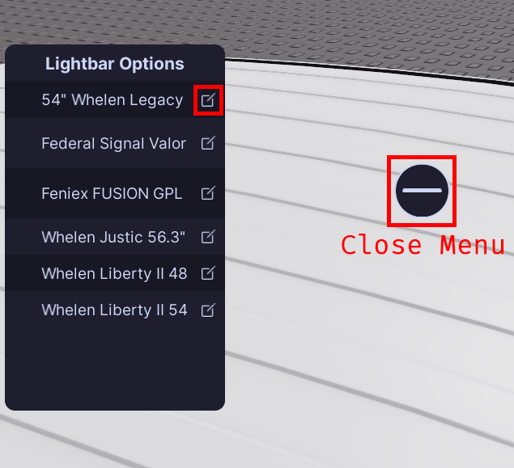
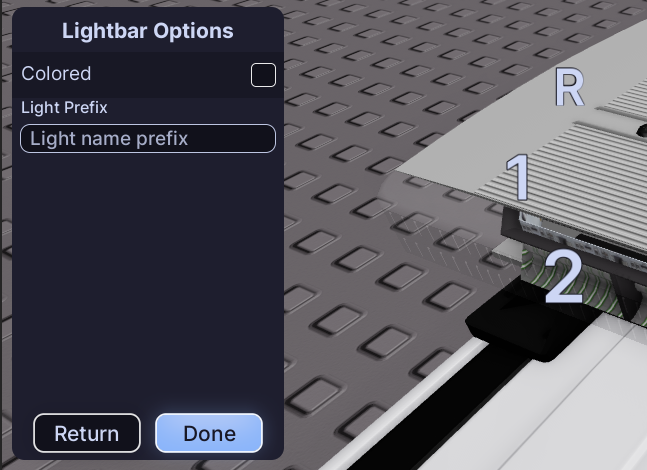

---
  authors:
    - parker02311
---

!!! tip ""
    Prefer videos? Check out our [YouTube playlist](https://youtube.com/playlist?list=PL7OqW0xeBKZTbk4QMl-6v3V_x11pZBV0W&si=e_bKE-MbL-B76wQk) for video guides on how to use the plugin.

??? warning "Documentation is a Work in Progress"
    This documentation is a work in progress and may be missing information or contain errors.
    If you need help please contact us on our [Discord server](https://redon.tech/discord)!

    If you know about this topic and want to help us, please consider contributing to this page on [GitHub](https://github.com/Redon-Tech/Emergency-Vehicle-Creator).

Great! Now that you have your vehicle inserted, it's time to configure the equipment for your vehicle.

## Overview

Once your vehicle is loaded in you will be have tons of little buttons around the vehicle. 
These are the equipment locations, each one represents different options you can have on your vehicle.

!!! tip "How to get back here later"
    If you ever close the plugin and need to get back to this point you can simply select your vehicle and hit "Edit Vehicle" in the main menu!

## Configuring Equipment

To configure the equipment on your vehicle, simply click on one of the equipment locations. 

This will open a menu where you can select the equipment you want to add to that location. 
Click the edit icon next the equipment name you would like to use/change. (See button outlined in the image below)

Once you click the edit icon, if that equipment was not already added to the vehicle, it will be added and you will be able to configure it. (See image below)

If the equipment has lights you will also see the lights names in the viewport, these are the names that you will use in the pattern creator.
Additionally, you will see an option to configure the "Light Prefix".

Clicking "Done" will save your changes and close the configuration menu. You can now repeat this process for any other equipment locations you want to configure.

## :material-check-circle: All Done!

Once you have configured all the equipment you want, click "Continue" at the top of the viewport to save your changes and exit to the function setup menu.

Here are some recommended next steps to help you get started:

1. **[Function Setup](..//..//els-setup/functions/setup.md)**: Learn how to setup functions to create ELS.
2. [Flashers](..//..//patterns/flashers.md): Learn how to create basic ELS patterns.
3. [Pre-Outfitted Vehicles](..//custom-vehicles/preoutfitted.md): Learn how to use your own vehicles.

---

If you encounter any issues or have questions, feel free to [contact us on Discord](https://redon.tech/discord).