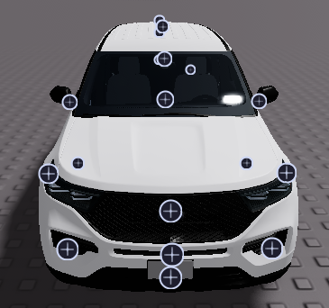
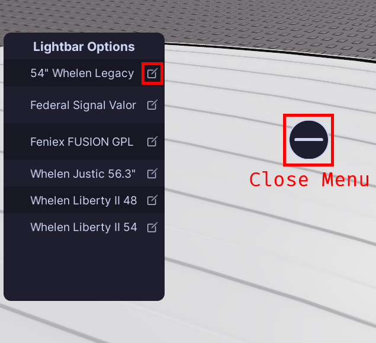
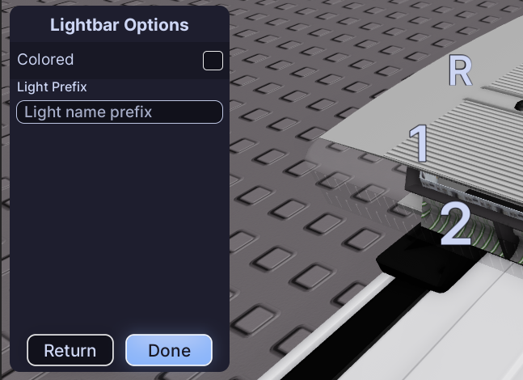

# Configuring Equipment

After placing your vehicle, the next step is adding the equipment you want to use.

## Equipment locations

When your vehicle is loaded, you will see equipment locations around it.

Click an equipment location to see what can be added there.

## Add and edit equipment

1. Click an equipment location.
2. Find the equipment you want.
3. Click the **Edit** button next to it.
4. If the equipment is not already on the vehicle, EVC adds it.
5. Change the equipment settings you need.
6. Click **Done** when finished.

If the equipment has lights, their names are shown in the viewport. You will use these names when creating light patterns.

## Light Prefix

**Light Prefix** changes the names used for the lights on that equipment.

These names are used by the pattern creator. If a light is missing when you create a pattern, check its equipment settings and Light Prefix.

## Finish

When you have finished setting up equipment, click **Continue** at the top of the viewport.

You can come back later by selecting the vehicle and clicking **Edit Vehicle** in EVC.

### What to do next

- **[Function Setup](../../els-setup/functions/index.md)** — set up functions.
- **[Flashers](../../patterns/flashers.md)** — create a basic light pattern.
- **[Light Settings](../../els-setup/light-settings.md)** — set up colors and light behavior.
