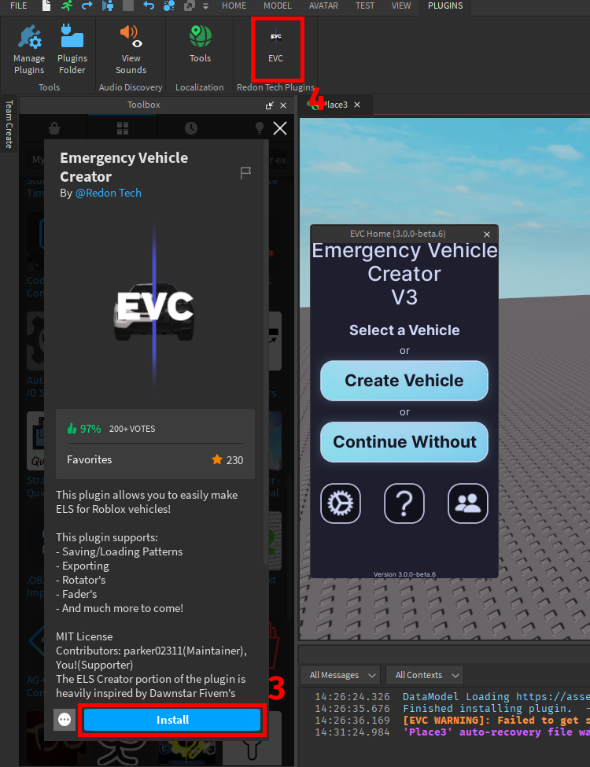
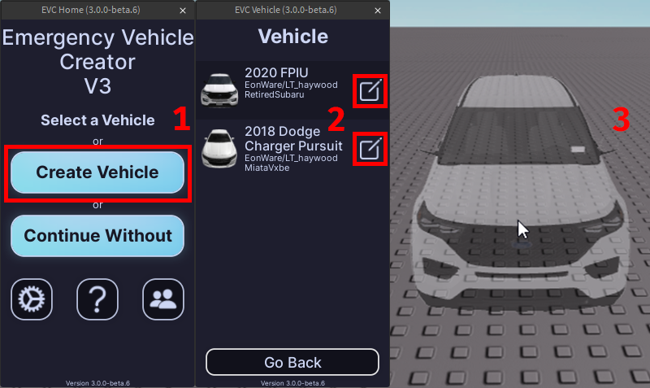

---
  authors:
    - parker02311
---

!!! tip ""
    Prefer videos? Check out our [YouTube playlist](https://youtube.com/playlist?list=PL7OqW0xeBKZTbk4QMl-6v3V_x11pZBV0W&si=e_bKE-MbL-B76wQk) for video guides on how to use the plugin.

??? warning "Documentation is a Work in Progress"
    This documentation is a work in progress and may be missing information or contain errors.
    If you need help please contact us on our [Discord server](https://redon.tech/discord)!

    If you know about this topic and want to help us, please consider contributing to this page on [GitHub](https://github.com/Redon-Tech/Emergency-Vehicle-Creator).

# Getting Started with the Vehicle Creator

Welcome to the Emergency Vehicle Creator! 

This guide will mark the beginning of your journey with Emergency Vehicle Creator. We are excited to show you how to create your first vehicle. 

Let's go over how to get your first vehicle inserted!

## Step 1: Accessing the plugin

1. Get the Emergency Vehicle Creator plugin from the [Roblox Marketplace](https://create.roblox.com/marketplace/asset/9953321418) if you haven't already.
2. Open Roblox Studio.
3. Install the plugin by going to "Toolbox" > "My Plugins" and selecting the Emergency Vehicle Creator plugin from your list of installed plugins.
      1. If you don't see it, you may need to refresh the Toolbox or restart Roblox Studio.
4. Launch the plugin by clicking on its icon in the Plugins tab.
      1. If the button doesn't appear, you may need to restart Roblox Studio or check if the plugin is enabled in the "Manage Plugins" section.
      2. If the old version is launched, please ensure you are updated!

!!! note "Plugin Permissions"
    When you open the plugin for the first time, it may ask for permissions.
    Please ensure you **allow all permissions requested**, otherwise the plugin may not work as intended or may not work at all.

## Step 2: Setting Up Your First Vehicle

1. In the main menu click on "Create Vehicle" button.
2. Once you find the vehicle you want to use, click the edit button on the right of the vehicle name.
3. Once the vehicle is loaded, you will see a ghost model in the workspace. Click once you find the location you want to place the vehicle.

## :material-check-circle: All Done!

Now that you have successfully inserted your first vehicle, you can start customizing it to your liking!

Here are some recommended next steps to help you get started:

1. **[Configuring Equipment](./configuring-equipment.md)**: Learn how to add and configure equipment for your vehicle.
2. [Pre-Outfitted Vehicles](..//custom-vehicles/preoutfitted.md): Learn how to use your own vehicles.
3. [Convert from V2 to V3](..//custom-vehicles/v2-v3.md): Learn how to convert your V2 vehicles to V3.

---

If you encounter any issues or have questions, feel free to [contact us on Discord](https://redon.tech/discord).