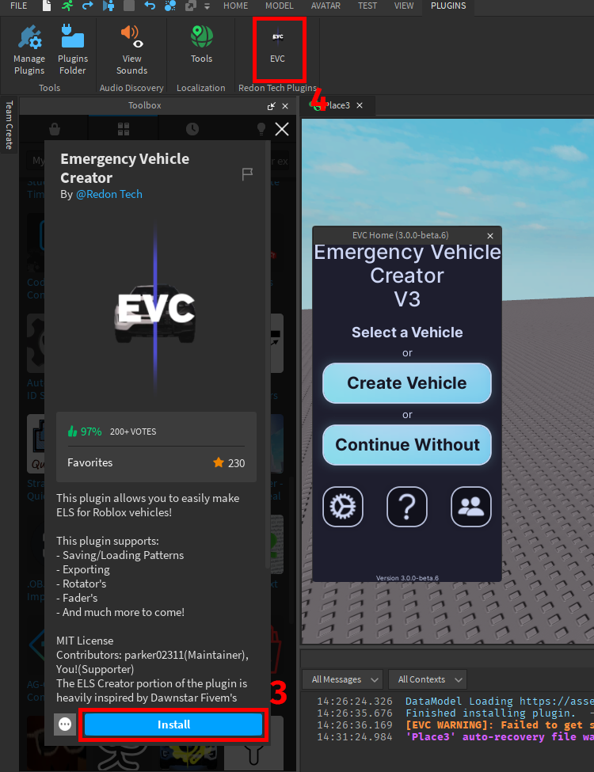
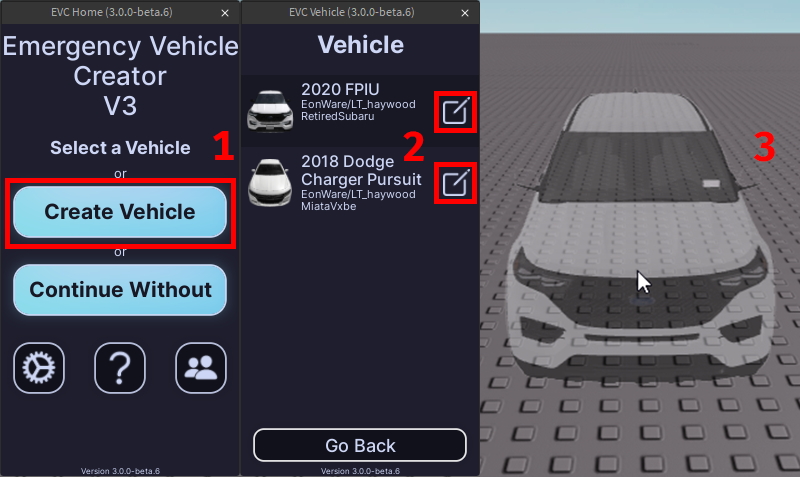

---
  authors:
    - parker02311
---

# Getting Started

This guide walks you through installing EVC and creating your first vehicle.

## 1. Install EVC

1. Get [Emergency Vehicle Creator](https://create.roblox.com/marketplace/asset/9953321418) from the Roblox Marketplace.
2. Open Roblox Studio.
3. Go to **Toolbox → My Plugins** and select Emergency Vehicle Creator.
4. Open the plugin from the **Plugins** tab.
5. If you do not see the plugin, refresh the Toolbox or restart Roblox Studio.
6. Make sure you are using the current version.

!!! note "Plugin permissions"
    Roblox Studio may ask you for permissions when you first open the plugin. Allow the permissions requested by EVC or some features may not work.

## 2. Create a vehicle

1. Open EVC and click **Create Vehicle**.
2. Find the vehicle you want to use.
3. Click the **Edit** button next to the vehicle.
4. Move the vehicle to the position you want.
5. Click to place it.

## 3. Start customizing

Once the vehicle is placed, you can start adding equipment and setting up its lights and sirens.

### What to do next

- **[Configuring Equipment](./configuring-equipment.md)** — add lights and other equipment.
- **[Function Setup](../../els-setup/functions/index.md)** — set up stages and other functions.
- **[Siren Setup](../../els-setup/siren-setup.md)** — set up sirens.
- **[Flashers](../../patterns/flashers.md)** — make your first flashing pattern.
- **[Pre-Outfitted Vehicles](../custom-vehicles/preoutfitted.md)** — edit a vehicle that is already set up for EVC.
- **[V2 to V3 Conversion](../custom-vehicles/v2-v3.md)** — convert an older EVC vehicle.

When you are finished, use **Export** to save your configuration to the vehicle.

If you need help, [contact us on Discord](https://redon.tech/discord).
